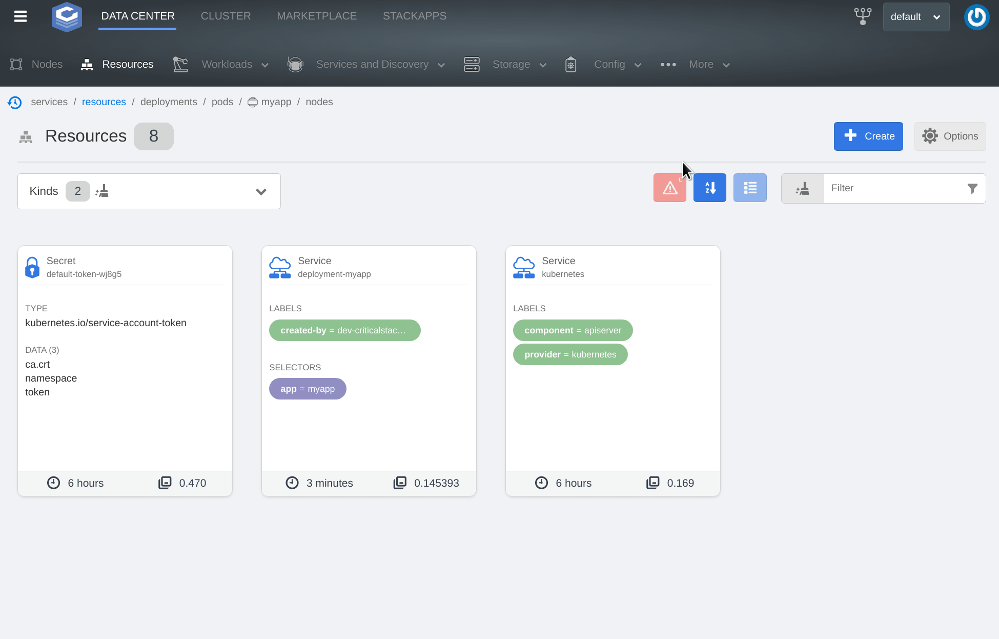

# Due to changes in the priorities, this project is currently not being supported. The project is archived as of 11/17/21 and will be available in a read-only state. Please note, since archival, the project is not maintained or reviewed. #

# ui

[](https://github.com/criticalstack/ui/actions)

The Critical Stack UI! See [the design docs](https://criticalstack.github.io/ui/design.html) for more details.



For a quick and easy local setup:

```shell
curl -sSfL https://get.crit.sh/quickstart | sh
```

[](https://asciinema.org/a/373515)

## Features

- [SSO integration](https://criticalstack.github.io/ui/features/sso.html) via [Dex](https://dexidp.io/)
- [Helm Marketplace](https://criticalstack.github.io/ui/features/marketplace.html)
- Container Shell & Logs View
- [Developer Shell](https://criticalstack.github.io/ui/features/developer-shell.html)
- [Intuitive Cluster Access Management](https://criticalstack.github.io/ui/features/user-management.html)
- Namespace Resource Overview
- [Worker Management](https://criticalstack.github.io/ui/features/machine-api.html) via [machine-api](https://github.com/criticalstack/machine-api)
- [StackApps Integration](https://criticalstack.github.io/ui/features/stackapps.html)

## Installation

Deployable as a Helm chart:

```shell
helm install cs-ui https://github.com/criticalstack/ui/releases/download/chart%2Fv1.0.0/ui-v1.0.1.tgz
```

See the [installation docs](https://criticalstack.github.io/ui/installation.html) for more.

## Troubleshooting

Check out our [Frequently Asked Questions](https://criticalstack.github.io/ui/faq.html)

## Contributing

Any contributors must accept and [sign the CLA](https://cla-assistant.io/criticalstack/ui).

This project has adopted the [Capital One Open Source Code of conduct](https://developer.capitalone.com/resources/code-of-conduct). 
