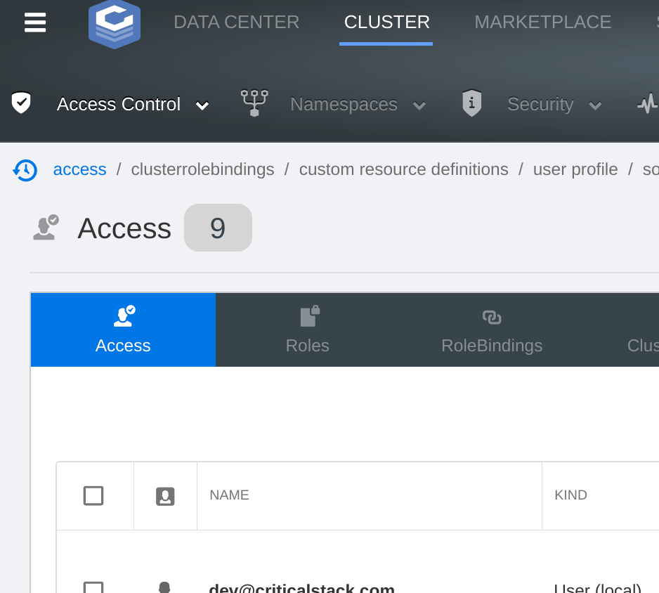

# Design

## Components

The Critical Stack UI depends on the following components, which are deployed:

- Kubernetes CRDs for users, applications, and dex configuration
- Services and Deployments for each of:
  - UI
    - Runs [controllers](../controllers/)
    - Serves [client](../client/) pages
    - Proxies [Kubernetes API requests & WebSocket connections](#kubernetes-api)
    - [Proxies Dex traffic](#dex)
  - [Dex](https://github.com/dexidp/dex)
    - See the SSO [integration docs](/features/sso.md)
  - [marketplace](https://github.com/criticalstack/marketplace)

In addition, existing services within the cluster are utilized when available:

- [Prometheus](/features/metrics.md) (metrics collection/aggregation)
- [StackApps](https://github.com/criticalstack/stackapps) CRDs (see [docs](./features/stackapps.md))


## Kubernetes API

All interactions with the Kubernetes API (creating and modifying resources, for example) are performed by the UI
deployment's Service Account on behalf of the acting user. The service account [impersonates](https://kubernetes.io/docs/reference/access-authn-authz/authentication/#user-impersonation) the user (and any groups they may belong to) in order to properly scope the permissions (see [RBAC](#rbac) below) of the user's session.

**Note**: because the UI is able to be used for cluster management (by a user with the appropriate role), the service
account in use has elevated permissions - by default a binding to the ClusterRole `cluster-admin`. As with any privileged tool, this means
that appropriate care should be taken when deploying and exposing the UI.

Most requests to the Kubernetes API server are proxied through a generic `/resources` endpoint which will apply the
appropriate impersonation information, validate inputs, and format the output for use by the frontend client.

In order to provide streaming logs, resource watches, and container shells, the UI server also proxies WebSocket
connections. If you are experiencing issues with these features, there may be a problem establishing the websocket
connection (commonly a load balancer is not configured appropriately) - see the [FAQ](./faq.md) for more info.

## RBAC

Because all user-initiated interactions with the Kubernetes cluster utilize impersonation (see above), _authorization_
for requests is effectively delegated to the Kubernetes API server. This has several benefits:

- Permissions will always be consistent between the UI and direct interaction (i.e. `kubectl`)
- User abilities can be controlled via declarative resources (Roles and RoleBindings) fully compatible with the
  Kubertentes ecosystem
- The surface area for vulnerabilities to be created/exploited is substantially smaller

The core Kubernetes RBAC model refers to users "lazily", only as the [subjects](https://kubernetes.io/docs/reference/access-authn-authz/rbac/#referring-to-subjects) of bindings. These users do not (necessarily) correspond to any sort of existing resource, it is up to the authentication service (in this case, [Dex](#dex)) to declare and keep track of these entities (the same is true of _Groups_).

<a name="users"></a>

The Critical Stack UI introduces a Custom Resource Definition for a cluster-level `User` resource to the Kubernetes API:

```shell
$ kubectl get users
NAME                                                              EMAIL                   ACTIVE   USERNAME                  AGE
sy3e5vknpktgkezpehh3rv76v5helr6vgnrm26feoz67stsosg6ef4jbdb2uegk   dev@criticalstack.com   true     "Cluster Administrator"   2d22h
```

These users correspond with subjects in rolebindings by their associated email address. Note that the resource name is
obtained as a hash of the user's email in order to meet [naming
requirements](https://kubernetes.io/docs/concepts/overview/working-with-objects/names/#names). This ensures that only
one user may exist in the cluster with a given email address.

The above user may be granted a role by creating the following `RoleBinding`:

```yaml
apiVersion: rbac.authorization.k8s.io/v1
kind: RoleBinding
metadata:
  name: my-admin-role-binding
  namespace: default
roleRef:
  apiGroup: rbac.authorization.k8s.io
  kind: Role
  name: my-role
subjects:
- kind: User
  name: "dev@criticalstack.com"
  apiGroup: rbac.authorization.k8s.io
```

Users have groups, at a minimum `system:authenticated` with others returned by Dex depending on SSO provider. The
  groups correspond with Groups in bindings:

```yaml
# ...
subjects:
- kind: Group
  name: "frontend-admins"
  apiGroup: rbac.authorization.k8s.io
```

See [user management](./user-management.md) for more information about the use of `User` resources.

## Dex

[Dex](https://github.com/dexidp/dex) is an authentication "portal" which uses _connectors_ to integrate with a
[variety](https://github.com/dexidp/dex#connectors) of upstream identity providers.

By configuring the Kubernetes API server to use Dex [as an OIDC provider](https://dexidp.io/docs/kubernetes), your
cluster can be setup to trust the tokens Dex issues to authenticated users. The CS UI provides a convenient method for
retrieving a token from Dex and downloading it in a `kubeconfig`:



In the configuration deployed by the UI [helm chart](/chart) the UI server acts as a proxy for all traffic to Dex -
requests to the `cs-ui` service with paths beginning `/dex/` are proxied to the `cs-ui-dex` Kubernetes service. This
serves several purposes:

- The Dex service does not need to be directly exposed to external traffic
- The Kubernetes API Server uses the UI endpoint as its OIDC issuer, which is assumed to already have a trusted SSL
  certificate for end-users
- CS UI acts as a builtin `authproxy` connector for Dex, allowing non-SSO ("local") users to generate Dex tokens

**Note:** by default, Dex serves traffic over HTTP. If HTTPS communication between the UI deployment and Dex service is
desired, additional configuration is required.
